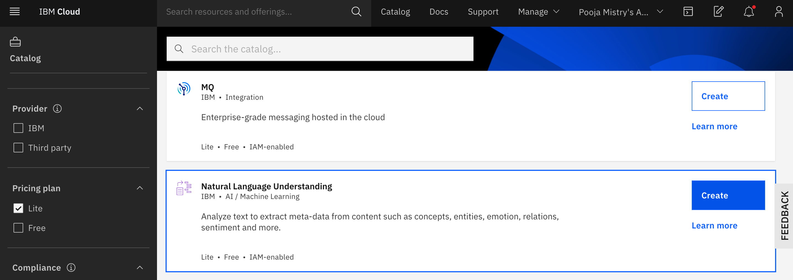

# WatsonSDK_Workshop


 Watson SDKs abstract much of the complexity associated with application development. By providing programming interfaces in languages that you already know, they can help you get up and running quickly with IBM Watson services. 
 
 ## Supported SDKs
 The following Watson SDKs are supported by IBM. You can find all SDKs [here](https://github.com/watson-developer-cloud)

 - [Android SDK](https://github.com/watson-developer-cloud/android-sdk)
 - [Go SDK](https://github.com/watson-developer-cloud/go-sdk)
 - [Java SDK](https://github.com/watson-developer-cloud/java-sdk)
 - [Node.js SDK](https://github.com/watson-developer-cloud/node-sdk)
 - [Python SDK](https://github.com/watson-developer-cloud/python-sdk)
 - [Ruby SDK](https://github.com/watson-developer-cloud/ruby-sdk)
 - [.NET SDK](https://github.com/watson-developer-cloud/dotnet-standard-sdk)
 - [Swift SDK](https://github.com/watson-developer-cloud/swift-sdk)
 - [Unity SDK](https://github.com/watson-developer-cloud/unity-sdk)

The Watson SDKs support our 11 Watson cognitive services across nine different programming languages including Node, Java, Python and Go. They enable developers to quickly and easily connect their applications to services like Speech to Text, Discovery and Assistant.

These services can be found in the [API & SDK reference library](https://cloud.ibm.com/docs?tab=api-docs&category=ai) Many AI/ Machine learning services can be created for free using the lite account on IBM Cloud. 


 In todays workshop we will walk through creating natural language understanding service service on IBM Cloud. Once we have created this services we will use the Watson SDK to get these services working with Node.js and Python.  

 ## Before You Begin 
- [IBM Cloud account](https://ibm.biz/WatsonSDK)

## Creating Services 
Once you have created an IBM Cloud Account you can search the cloud catalog for `Lite` and find a service you would like to create.

In our case we will be creating a `Natural Language Understanding` and a `Language Translator Service` 


Once you have these services created we can get started with using the SDKs 

## Let's Get Started with Node 
 The [Node SDK](https://github.com/watson-developer-cloud/node-sdk) is tested with Node versions 10 and up . 

###  Installation 
Make a directory and install the ibm-watson node package
```npm install ibm-watson@^5.7.0``` 

### Step 1: Playing with NLU - Instantiate an authenticator 
Let's get started by creating a simple `.js` file 


### Step 2: Using .env files 


### Step 3: NLU demo 


### Authentication 

### API Docs 


## Let's Get Started with Python 

### Authentication 


## Demos & Resources 


