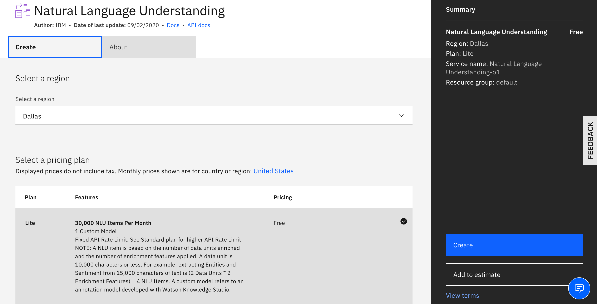
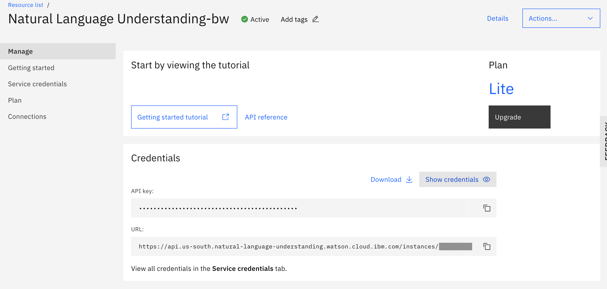
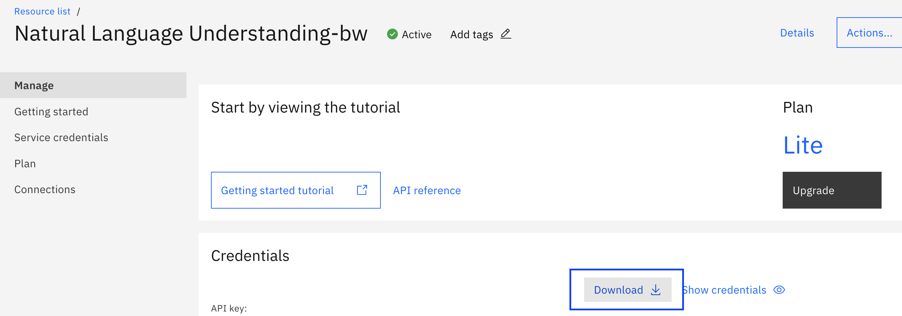
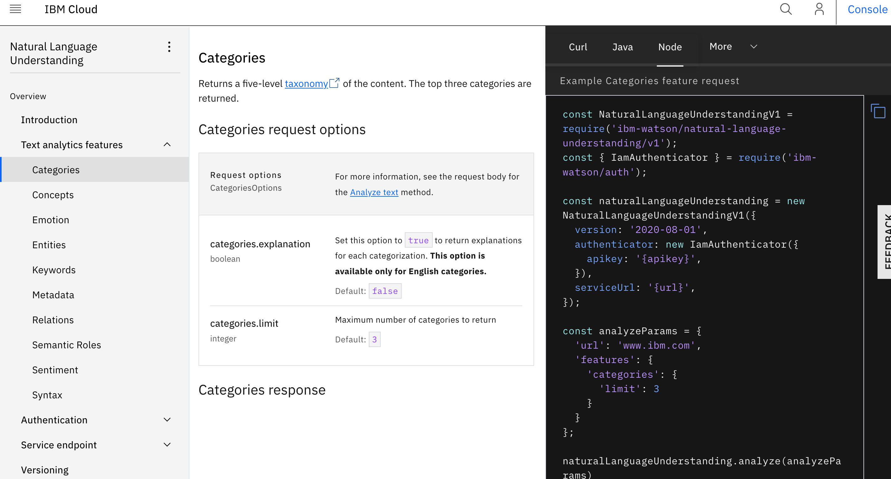
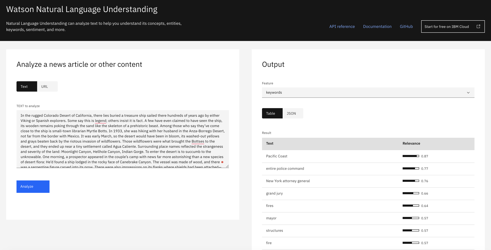

# WatsonSDK_Workshop


 Watson SDKs abstract much of the complexity associated with application development. By providing programming interfaces in languages that you already know, they can help you get up and running quickly with IBM Watson services. 
 
 ## Supported SDKs
 The following Watson SDKs are supported by IBM. You can find all SDKs [here](https://github.com/watson-developer-cloud)

 - [Android SDK](https://github.com/watson-developer-cloud/android-sdk)
 - [Go SDK](https://github.com/watson-developer-cloud/go-sdk)
 - [Java SDK](https://github.com/watson-developer-cloud/java-sdk)
 - [Node.js SDK](https://github.com/watson-developer-cloud/node-sdk)
 - [Python SDK](https://github.com/watson-developer-cloud/python-sdk)
 - [Ruby SDK](https://github.com/watson-developer-cloud/ruby-sdk)
 - [.NET SDK](https://github.com/watson-developer-cloud/dotnet-standard-sdk)
 - [Swift SDK](https://github.com/watson-developer-cloud/swift-sdk)
 - [Unity SDK](https://github.com/watson-developer-cloud/unity-sdk)

The Watson SDKs support our 11 Watson cognitive services across nine different programming languages including Node, Java, Python and Go. They enable developers to quickly and easily connect their applications to services like Speech to Text, Discovery and Assistant.

These services can be found in the [API & SDK reference library](https://cloud.ibm.com/docs?tab=api-docs&category=ai) Many AI/ Machine learning services can be created for free using the lite account on IBM Cloud. 


 In todays workshop we will walk through creating natural language understanding service service on IBM Cloud. Once we have created this services we will use the Watson SDK to get these services working with Node.js and Python.  

 ## Before You Begin 
 Please create an [IBM Cloud account](https://ibm.biz/WatsonSDK)

## Creating Services 
Once you have created an IBM Cloud Account you can search the cloud catalog for `Lite` and find a service you would like to create.

In our case we will be creating a `Natural Language Understanding` and a `Language Translator Service` 


Once you have these services created we can get started with using the SDKs 

## Let's Get Started with Node 
 This SDK is tested with Node versions 10 and up.  All official documentation on the Node SDK is found [here](https://github.com/watson-developer-cloud/node-sdk)

###  Installation 
Make a directory and install the ibm-watson node package
```npm install ibm-watson@^5.7.0``` 

### Part 1: Playing with NLU in Node - Instantiate an authenticator 
Let's get started by creating a simple `nlu_example1.js` file 
In this file you will be extracting metadata such as concepts, keywords, categories, sentiment, and emotion from the url `www.nytimes.com`

For more documentation on NLU data extraction please see [Natural Language API DOCs](https://cloud.ibm.com/apidocs/natural-language-understanding?code=node)

```
const NaturalLanguageUnderstandingV1 = require('ibm-watson/natural-language-understanding/v1');
const { IamAuthenticator } = require('ibm-watson/auth');

const naturalLanguageUnderstanding = new NaturalLanguageUnderstandingV1({
  version: '2019-07-12',
  authenticator: new IamAuthenticator({
    apikey: "<apikey>",
  }),
  url: "<url>",
});

const analyzeParams = {
  'url': 'www.nytimes.com',
  'features': {
    'categories': {
      'limit': 3,
      'explanation' : true
    },
    'concepts' : {
        'limit' : 3
    },
    'entities': {
        'sentiment': true,
        'limit': 1,
        'emotion': true
      },
      'keywords': {
        'sentiment': true,
        'emotion': true,
        'limit': 3
      }
  }
};

naturalLanguageUnderstanding.analyze(analyzeParams)
  .then(analysisResults => {
    console.log(JSON.stringify(analysisResults, null, 2));
  })
  .catch(err => {
    console.log('error:', err);
  });
  
  ```

You will have to include the API Key and service URL which you can find in the credentials section of the service you just created : 



Once you add your service credentials you should be able to analyze with NLU. 

See[nlu_example1](https://github.com/pmmistry/WatsonSDK_Workshop/blob/master/nlu_example/nlu_example1.js) for more details

### Part 2: Using .env files 
You can also authenticate to a service by automatically allowing credentials to be read from an environment file. 

 
With a credentials file, you just need to put the file in the right place and the SDK will do the work of parsing it and authenticating. You can get this file by clicking the Download button for the credentials in the Manage tab of your service instance.



The file downloaded will be called `ibm-credentials.env`. This is the name the SDK will search for and must be preserved unless you want to configure the file path ([see docs](https://github.com/watson-developer-cloud/node-sdk#supplying-credentials)). The SDK will look for your `ibm-credentials.env` file in the following places (in order):

   - Directory provided by the environment variable IBM_CREDENTIALS_FILE
   - Your system's home directory
   - Your current working directory (the directory Node is executed from)

As long as you set that up correctly, you don't have to worry about setting any authentication options in your code. 


Example of using .env file 
```
'use strict';

require('dotenv').config({
  silent: true,
});

const NaturalLanguageUnderstandingV1 = require('ibm-watson/natural-language-understanding/v1');
const naturalLanguageUnderstanding = new NaturalLanguageUnderstandingV1({
  version: '2019-07-12'
});

const analyzeParams = {
  'url': 'www.ibm.com',
  'features': {
    'categories': {
      'limit': 3
    }
  }
};

naturalLanguageUnderstanding.analyze(analyzeParams)
  .then(analysisResults => {
    console.log(JSON.stringify(analysisResults, null, 2));
  })
  .catch(err => {
    console.log('error:', err);
  });

```
See[nlu_example2](https://github.com/pmmistry/WatsonSDK_Workshop/blob/master/nlu_example/nlu_example2.js) for more details


[nlu_example3](https://github.com/pmmistry/WatsonSDK_Workshop/blob/master/nlu_example/nlu_example3.js) also has an example that authenticates using the `ibm-credentials.env` file with text file data . 

Feel free to play around with more NLU API and configurations found in the [Natural Language API Docs](https://cloud.ibm.com/apidocs/natural-language-understanding?code=node) as well as any other services that are supported by the SDK. Other services can be found in the [API & SDK reference library](https://cloud.ibm.com/docs?tab=api-docs&category=ai) 




### Part 3: NLU demo 
Now that you are familiar with using the Node SDK lets create a NLU Node Demo project. 

#### Step 1. Clone Repo 
Clone this repo into your directory : https://github.com/IBM/natural-language-understanding-code-pattern

#### Step 2. Download `.env` file and add to repo
 

#### Step 3. Install the dependencies
```npm install```

#### Step 4. Build the application
```npm run build```

#### Step 5. Run the application
```npm run dev```

#### Step 6. View the application in a browser 
Your browser will point to `localhost:5000`



You can follow [these steps](https://github.com/IBM/natural-language-understanding-code-pattern#deploying-to-ibm-cloud-as-a-cloud-foundry-application) on this repo to deploy application to the cloud 


## Let's Get Started with Python 
This SDK is tested with Python versions 3.5 and up.  All official documentation on the Python SDK is found [here](https://github.com/watson-developer-cloud/python-sdk)

###  Installation 
Make a directory and install using pip or easy_install:
```pip install --upgrade ibm-watson```
or 
```easy_install --upgrade ibm-watson```

### Part 1. Playing with NLU in Python - Instantiate an authenticator 
Let's get started by creating a simple `nlu_example1.py` file 

```import json
from ibm_watson import NaturalLanguageUnderstandingV1
from ibm_cloud_sdk_core.authenticators import IAMAuthenticator
from ibm_watson.natural_language_understanding_v1 import Features, CategoriesOptions


authenticator = IAMAuthenticator('<apiKey>')
natural_language_understanding = NaturalLanguageUnderstandingV1(
    version='2019-07-12',
    authenticator=authenticator
)
natural_language_understanding.set_service_url('<URL>')

response = natural_language_understanding.analyze(
    url='www.ibm.com',
    features=Features(categories=CategoriesOptions(limit=3))).get_result()

print(json.dumps(response, indent=2))
```

Add your API Key and URL from NLU Credentials 


### Part 2.Using .env files 

### Part 3. Jupyter Notebook Demo 

## Code Patterns & Resources 

### API Docs 
 - [Watson Assistant Docs](https://cloud.ibm.com/docs/watson?topic=watson-using-sdks)
 - [API & SDK reference library](https://cloud.ibm.com/docs?tab=api-docs&category=ai)
 - [Watson Developer Cloud](https://github.com/watson-developer-cloud)

### Code Patterns 
 - [Speech to Text](https://github.com/IBM/speech-to-text-code-pattern)
 - [Text to Speech](https://github.com/IBM/text-to-speech-code-pattern)
 - [Visual Recognition](https://github.com/IBM/visual-recognition-code-pattern)
 - [Discovery](https://github.com/watson-developer-cloud/discovery-nodejs)
 - [Assistant](https://github.com/watson-developer-cloud/assistant-demo)


